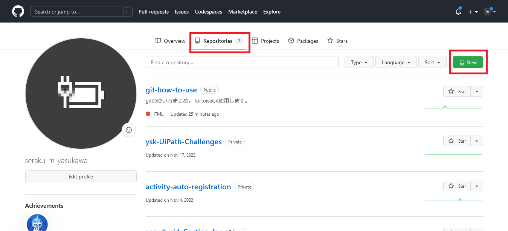

# 01_リポジトリ作成

## 前提
- githubのアカウントは作成済
- TortoiseGitはまだDLしてない

## 参考
これから書くようなことはほとんど下記URLに載っています。
- [サル先生のGit入門〜バージョン管理を使いこなそう〜【プロジェクト管理ツールBacklog】](https://backlog.com/ja/git-tutorial/)

## 目次
- [01\_リポジトリ作成](#01_リポジトリ作成)
	- [前提](#前提)
	- [参考](#参考)
	- [目次](#目次)
- [リポジトリとは？](#リポジトリとは)
- [手順](#手順)
	- [1. リポジトリ作成画面を開く](#1-リポジトリ作成画面を開く)
	- [2. 色々と設定を書き込む](#2-色々と設定を書き込む)
	- [3. 完成](#3-完成)

# リポジトリとは？
ファイルやフォルダをまとめてリポジトリと呼ぶ。

# 手順
## 1. リポジトリ作成画面を開く
まず自分のホーム画面？を開き、このへんをクリックする。

## 2. 色々と設定を書き込む
こんな感じの画面が表示されるので、色々と書き込む。

 

1. Repository name
   レポジトリの名前。短くてわかりやすいものを付ける。
   実は自動生成してくれている、名前を付けるときの参考になるかも。

1. Description (optional)
   レポジトリの説明。書かなくても作成はできるけど、書こう。

1. Public / Private
   全世界に公開するかしないか。Publicだと誰でも見れる。
1. Add a README file
   リポジトリのREADMEファイルを作成するかしないか。Markdown記法で書く。
   この時点でチェックしておくと、ほんのちょっとだけ自動生成してくれる。
   また、後からでも追加できる。
1. Add .gitignore
   .gitignoreファイルを作成するかしないか。.gitignoreファイルとは、コミットするときに除外したいファイルの一覧を書き込むファイル。詳細は別途予定。
   これも後から追加できる。
1. Choose a license
   使ってるライセンス。使うことはあまりないと思われる。

 

書き込んだあと。

とりあえずPrivateに。  
READMEファイルは作成して、.gitignoreは必要になったら追加するつもり。
`Create repository`を押せば作成される。

## 3. 完成
これで完成。READMEの内容は、リポジトリのトップページに表示される。

