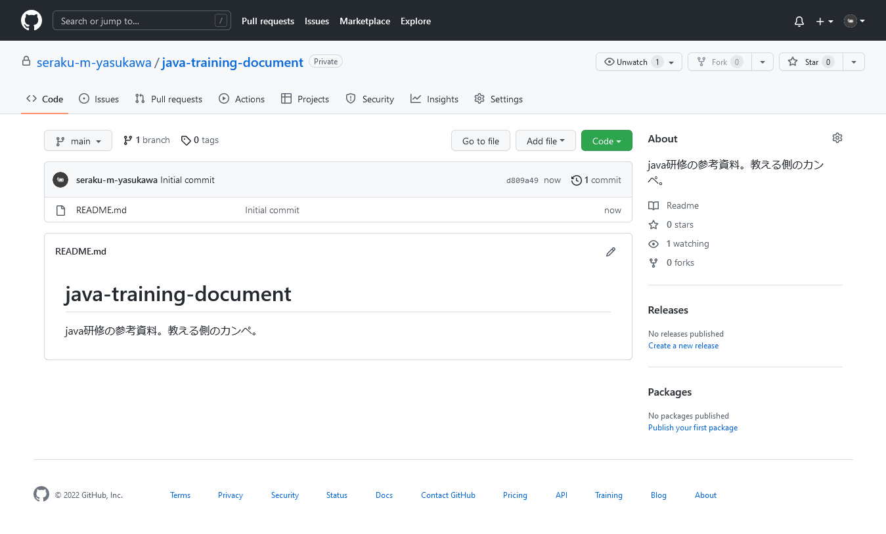
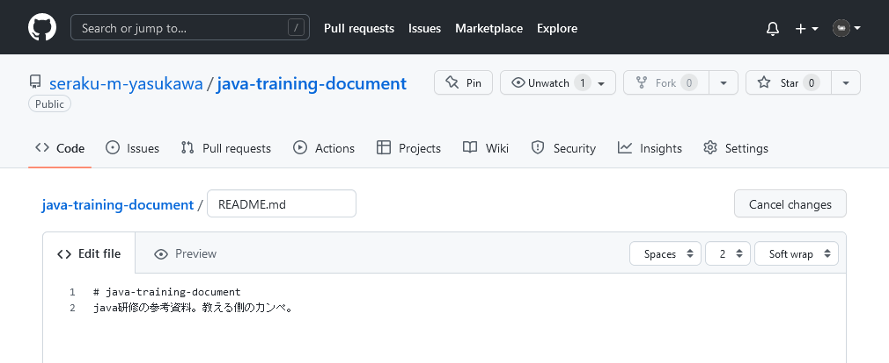
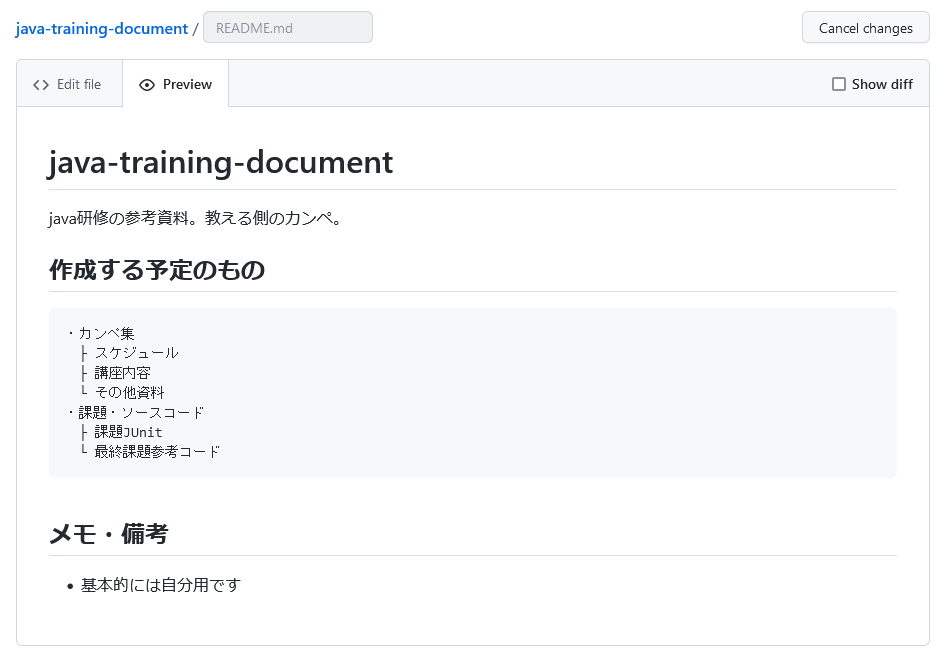
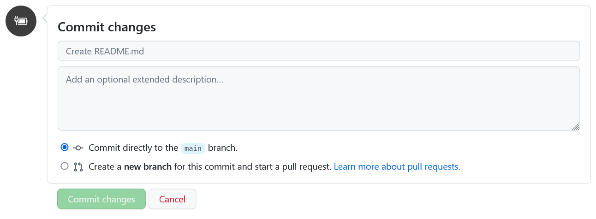
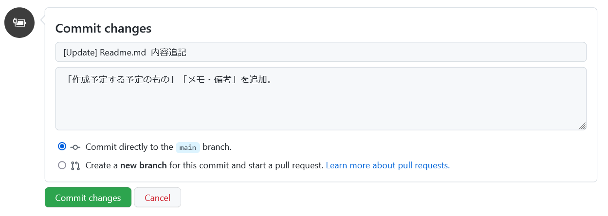
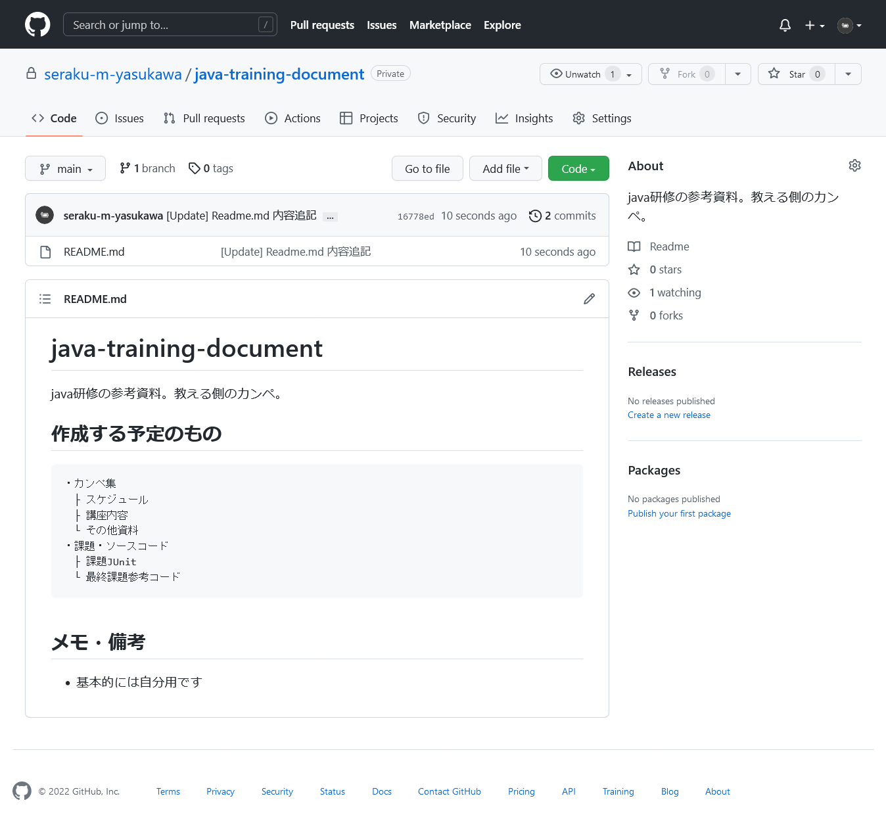
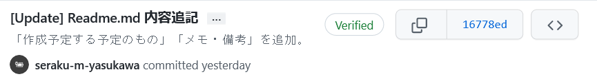

# 02_githubでコミット
READMEに追記し、コミットする。

## 前提
- リポジトリ作成済
- TortoiseGitはまだ
- md記法の詳細な解説は行わない

## 目次
- [02\_githubでコミット](#02_githubでコミット)
	- [前提](#前提)
	- [目次](#目次)
- [コミットとは？](#コミットとは)
- [手順](#手順)
	- [1. READMEのEditに進む](#1-readmeのeditに進む)
	- [2. READMEに記述する。](#2-readmeに記述する)
	- [3. 変更をコミットする](#3-変更をコミットする)
	- [完成](#完成)

# コミットとは？
ファイルやフォルダへ行った変更を、リポジトリへ反映させること。

# 手順
## 1. READMEのEditに進む
READMEの右上あたりのEditボタン（鉛筆マーク）をクリックする。

するとこんなページに遷移する。

## 2. READMEに記述する。
md記法で書き込む。解説が必要なら別途。

TIPS

タブのPreviewを選択すると、書いたmdのレビューができる。編集終える前に一度確認しておくべき。

## 3. 変更をコミットする
画面下のほうに`Commit changes`が表示されているので、ここにコミットの内容を記載する。

1. 一番上の欄（Create README.md）
   コミット内容の概要？何をしたかを記述する。
   現場によって書き方は変わるけど、先頭にコミットの種別、その次に概要を記述することが多いと思う。
   
1. 2つめの欄 (Add an optional~)
   コミット内容の詳細。概要レベルで把握できるなら書かなかったり。
1. Commit directly~ / Create a new Branch~
   直接`main`ブランチにコミットするか、新しくブランチをきってプルリクエストを投げるか。
   ブランチ・プルリクエストについては別途。

 

コミットメッセージの例としてはこんな感じ。

これで`Commit changes`をクリックすればコミットされる。

## 完成
これで完成。READMEの内容が変更された。

 

コミット内容は右上の時計っぽいボタンから確認できる。  

さっきのコミットメッセージはこんな感じ。

