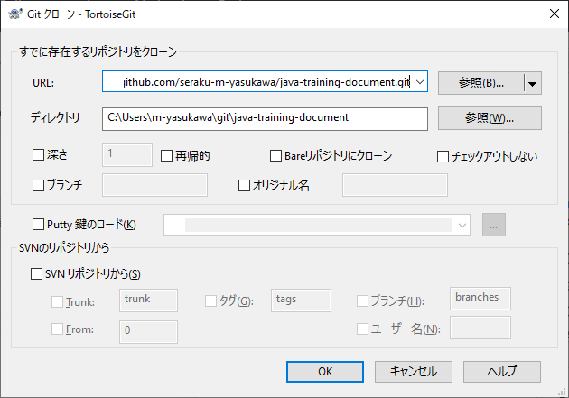
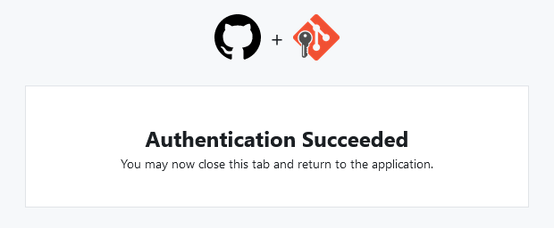
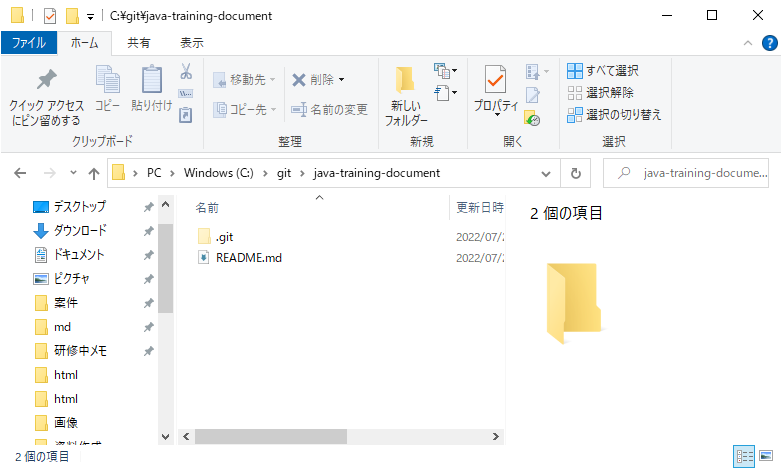
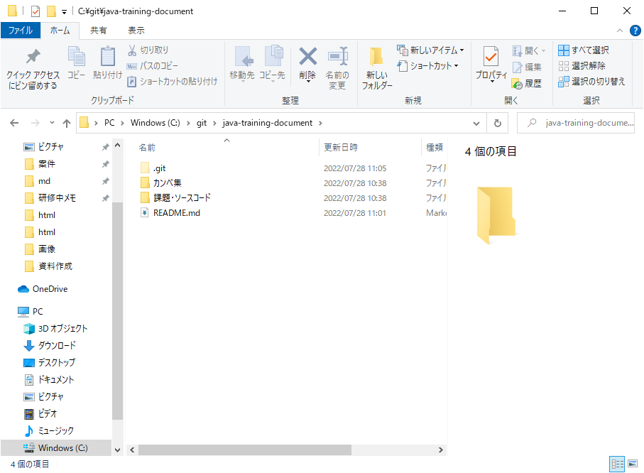
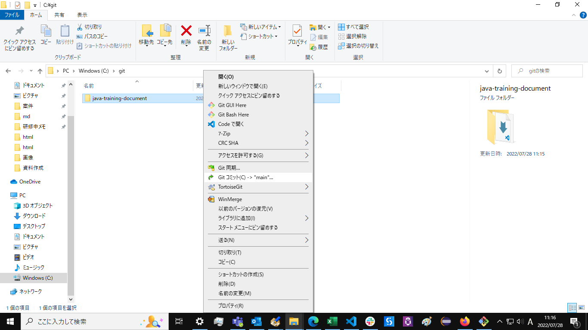
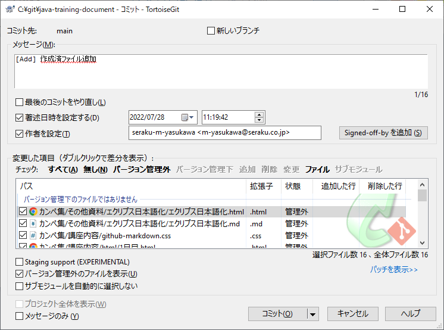
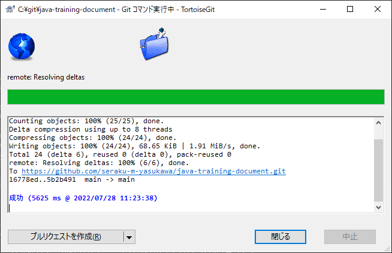
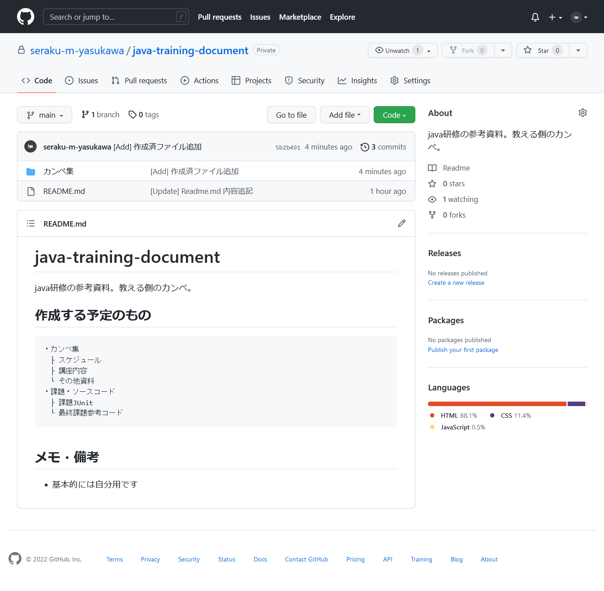
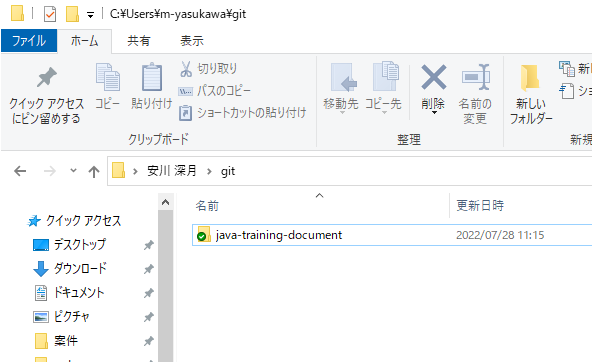
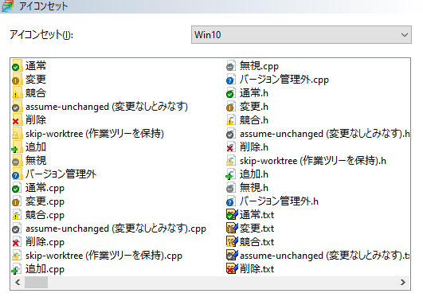

# 03_TortoiseGitでgitクローン、コミット、プッシュ
TortoiseGitとgithubの連携を行い、TortoiseGitからコミットする。

## 前提
- githubのアカウントは作成済
- TortoiseGitはまだDLしてない

## 概要（何してるの？）
実は、javaの資料は既にある程度作成済だったので、githubにアップロードしてコミットしたい。  
githubに直接アップロードしてもいいけど、ここではTortoiseGitを使ってコミットして目的を果たす。

## 目次
- [03_TortoiseGitでgitクローン、コミット、プッシュ](#03_tortoisegitでgitクローンコミットプッシュ)
	- [前提](#前提)
	- [概要（何してるの？）](#概要何してるの)
	- [目次](#目次)
- [TortoiseGitとは？](#tortoisegitとは)
- [手順 - gitクローン](#手順---gitクローン)
	- [gitクローンとは？](#gitクローンとは)
	- [0. TortoiseGitの準備](#0-tortoisegitの準備)
	- [1. どこかにgit用フォルダを作る](#1-どこかにgit用フォルダを作る)
	- [2. gitクローンする](#2-gitクローンする)
		- [TortoiseGitとgithubの連携](#tortoisegitとgithubの連携)
	- [3. クローン完了](#3-クローン完了)
- [手順 - コミット](#手順---コミット)
	- [1. コミット画面を開く](#1-コミット画面を開く)
	- [2. コミットの設定をして実行](#2-コミットの設定をして実行)
	- [3. コミット完了](#3-コミット完了)
- [手順 - プッシュ](#手順---プッシュ)
	- [1. プッシュ画面を開く](#1-プッシュ画面を開く)
	- [2. プッシュする](#2-プッシュする)
	- [3. プッシュ完了](#3-プッシュ完了)
- [チェックマークについて](#チェックマークについて)


# TortoiseGitとは？
> TODO:めっちゃ便利なやつ、詳細は誰かが書く


# 手順 - gitクローン
まず、github上に存在するコードをローカルに持ってきたい。  
普通にZipファイルをダウンロードしても持ってこれるが、コミットとかしたいので、`gitクローン`というのを行う。  
`gitクローン`をすると、いい感じに連携できると思ってもらいたい。

## gitクローンとは？
> TODO:githubとかからローカルにもらってくる的な、説明は誰か


## 0. TortoiseGitの準備
インストールして日本語化までする。gitがまだだったらそっちもする。  
詳細は割愛。下記URL参考に。
[Gitのインストール｜サル先生のGit入門【プロジェクト管理ツールBacklog】](https://backlog.com/ja/git-tutorial/intro/05/)


## 1. どこかにgit用フォルダを作る
ひとまず、どこかにgit用のフォルダを作る。C直下やユーザー直下に「git」とか、わかりやすい名前を付けて作成。  
この中にリポジトリを持ってくるイメージ。
```text 
C:
  └git
    ├ java-training-document
    │ ├─ カンペ集
    │ │  ├─ その他資料
    │ │  ├─ スケジュール
    │ │  └─ 講座内容
    │ └─ 課題・ソースコード
    │ 
    ├ 別のレジストリ
   ...
```
フォルダ構成は上記のようになっていく。


## 2. gitクローンする
作ったフォルダを右クリックして、`gitクローン(複製)...`を選択。


下記のようなgitクローン画面が表示される。

<div>


<div style="margin-top: 1em; line-height: 1.4; font-size: 100%;">


1. URL:
   クローンする元のリポジトリのURLを入力する。

1. ディレクトリ
   クローン先のフォルダ。特にいじることはない。

</div>
</div><br/>

gitクローン画面に入力するためのURLを取得する。  
githubのページの、`Code`からコピーできる。


`URL:`欄に、コピーしたURLを貼り付ける。  
すると、クローン先のパスにレポジトリ名のディレクトリが自動的に追加される。  
このディレクトリは、クローン実行時に作成される。


チェックは特にせず、そのまま`OK`を選択。  
コマンド実行中のウィンドウが表示される。

### TortoiseGitとgithubの連携
<details><summary>連携を求められたら</summary>

<div style="margin-left: 1em; border-bottom: dashed var(--color-border-muted); border-bottom-width:thin;">

TortoiseGitとgithubの連携を求める、下記のような画面が表示されている想定。


言われるがままに連携を進めていけばよい。はず。




連携終了すればコマンド実行が再開される。
</div>

</details>

## 3. クローン完了
コマンドが成功したら完了。


gitフォルダを開くと、githubのレジストリと同じフォルダ構成になっている。

<div>
	

<div style="margin-left: 1em;">
	
	<p style="margin-left: 1em;">※ツリー表示にするとこんな感じ。</p>
</div>


</div>
<br/>

> 緑のチェックマークについては後述します。
> 現状では、付いていてもいなくても問題ありません。


# 手順 - コミット
リポジトリをローカルに持ってきたので、早速ファイルを追加する。  
ファイルをコピペするだけなのでここは割愛。




## 1. コミット画面を開く
右クリックし、`Git コミット(C) > "main"...`を選択。



## 2. コミットの設定をして実行
下記のような画面が表示されるので、メッセージを書き込み、コミットするファイルを選択する。

<div>


<div style="margin-top: 1em; line-height: 1.4; font-size: 90%;">


1. メッセージ(M):
   そのままの意味。メッセージ。
   1行目がgithubでコミットするときの概要、2行目からが詳細となる。

1. 変更した項目
   変更されたファイルの一覧。チェックされたファイルがコミットされる。
   今回は新規ファイルを追加したので、各ファイルの状態は「管轄外」となっている。

</div>
</div><br/>

コミット(O)をクリックすればコミットが実行され、コマンド実行中のウィンドウが表示される。


## 3. コミット完了
コマンドが成功したら完了。


# 手順 - プッシュ
今の作業では、ローカルのリポジトリにしか変更が反映されていない。  
githubのリポジトリに変更を反映させるため、プッシュする必要がある。  
とりあえず、このままプッシュしてしまう。
> TODO: プッシュについて誰かが書く

## 1. プッシュ画面を開く
さっきのコミット完了のウィンドウの、左下の`プッシュ(H)`をクリック。  
もし閉じていた場合は、リポジトリのフォルダを右クリックし、`TortoiseGit > プッシュ(H)...`と選択する。


## 2. プッシュする
下記のような画面が表示されるので、今回はそのまま`OK`を選択する。  
プッシュについては別途解説予定。


`OK`を選択すると、いつものコマンド実行画面が表示される。


## 3. プッシュ完了
コマンドが成功すれば完了。



無事にgithubにも変更が反映されている。



# チェックマークについて
git管理されているファイルやフォルダは、アイコンにマークが付く。  
マークがついていない場合は、最新の状態に更新するか、PCを再起動すれば付くようになるはず。


アイコンの種類と意味は以下の通り。この一覧はTortoiseGitの設定から確認できる。



