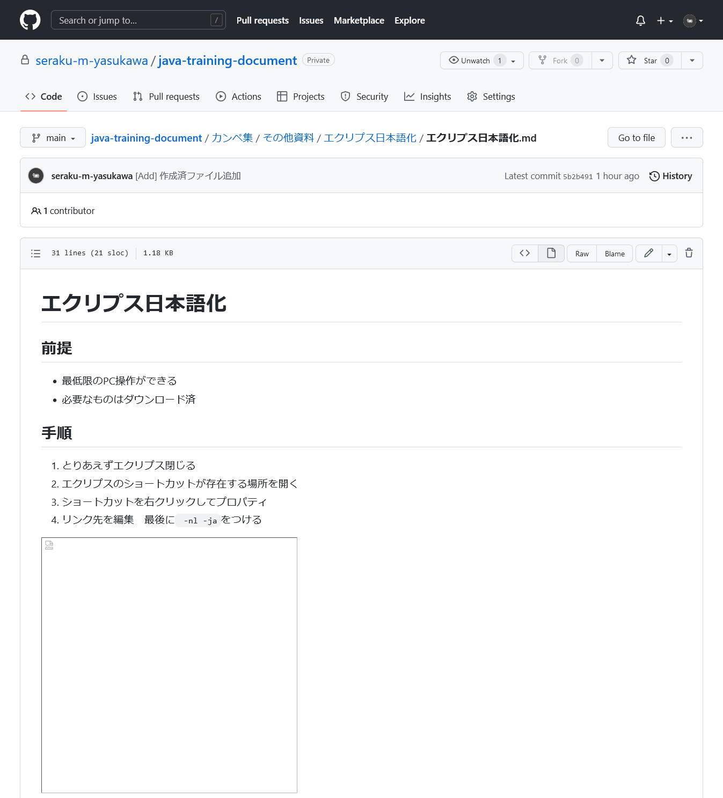
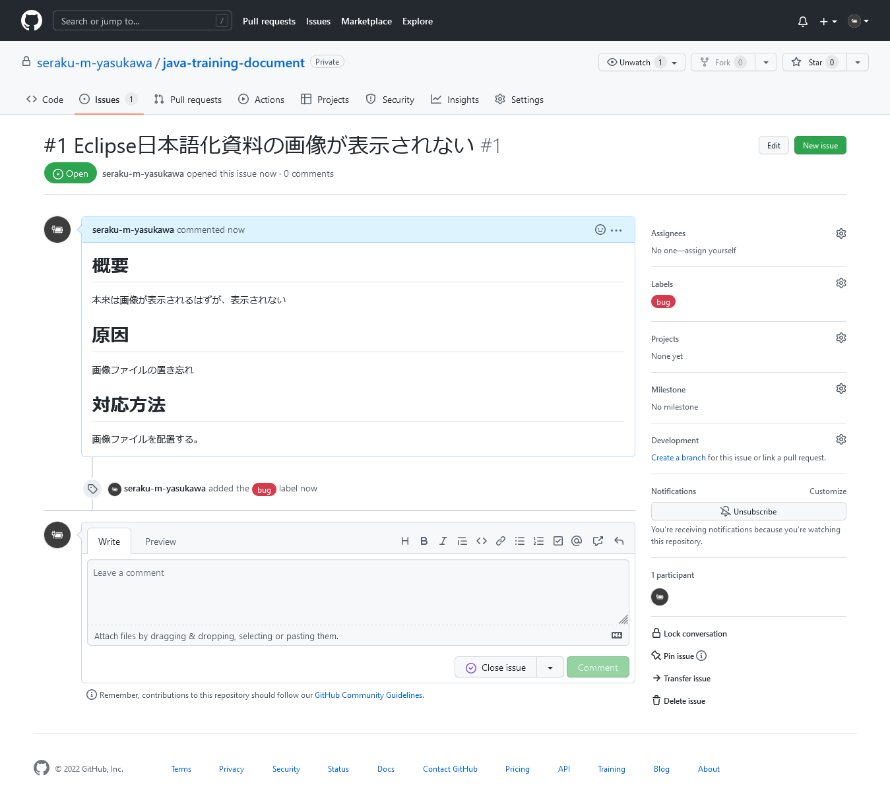
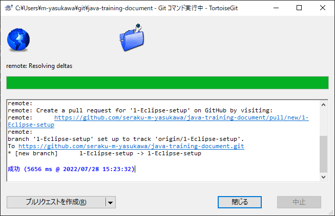
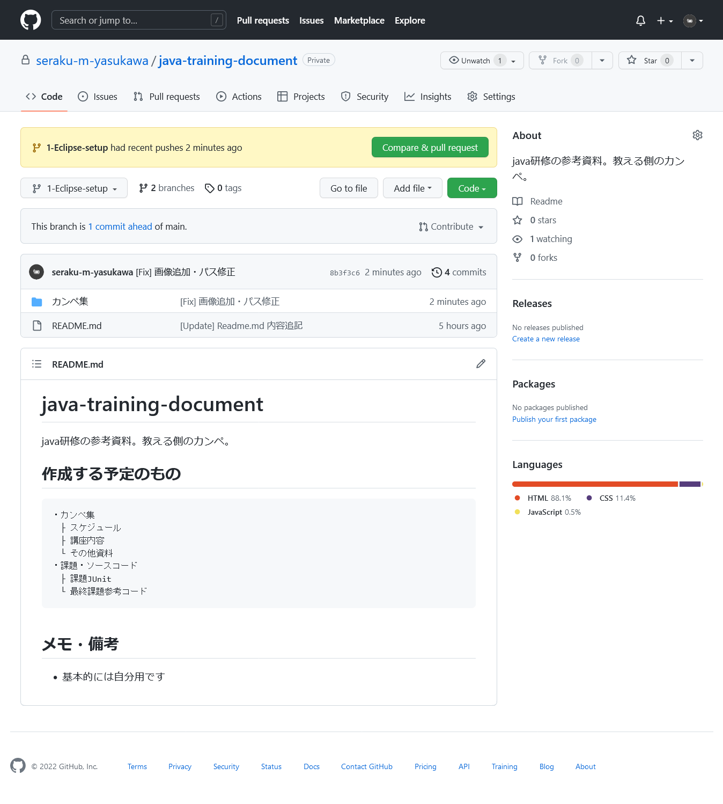

# 03_branch

TortoiseGitとgithubの連携を行い、TortoiseGitからコミットする。

## 前提
- githubのアカウントは作成済
- TortoiseGitはまだDLしてない

## 概要（何してるの？）
プッシュしたので、早速githubでファイルを確認してみる。

すると、貼り付けた画像が正しく表示されていない。  
原因は単純で、画像ファイルをリポジトリに追加するのを忘れていたから。  
これを修正するために、issueを作成し、ブランチをきって、マージまで行う。

## 目次
- [03_branch](#03_branch)
	- [前提](#前提)
	- [概要（何してるの？）](#概要何してるの)
	- [目次](#目次)
- [手順 - Issue作成](#手順---issue作成)
	- [1. Issue画面を開く](#1-issue画面を開く)
	- [2. Issue内容を書き込む](#2-issue内容を書き込む)
	- [3. Issue作成完了](#3-issue作成完了)
- [手順 - ブランチをきる](#手順---ブランチをきる)
	- [1. ブランチ作成画面を開く](#1-ブランチ作成画面を開く)
	- [2. ブランチの情報を入力する](#2-ブランチの情報を入力する)
	- [3. ブランチ作成完了](#3-ブランチ作成完了)
- [手順 -](#手順--)
	- [0. 修正、コミット、プッシュ](#0-修正コミットプッシュ)
	- [1.](#1)

# 手順 - Issue作成
Issueとは、何かしらのタスクや課題のこと。gitを使う場合、Issueによって課題を管理することが多い。
Issueによる課題管理の流れは以下のようになる。
1. 課題発生、Issue作成
1. Issue内で課題についてやり取りをしながら課題解決
1. 課題解決、Issueを閉じる

## 1. Issue画面を開く
リポジトリ画面から、Issueを開き、右上の`New issue`を選択する。

## 2. Issue内容を書き込む
下記のような画面が表示されるので、Issueの内容を書き込む。

1. Title
   Issueのタイトル。概要を書き込む。
   誰が見ても一目でわかるように心がける。
1. Leave a comment
   Issueの詳細。md記法。できる限り細かく書く。
   例えばバグの修正の場合、
	1. 問題
		今何が起きているか？
	1. 原因
		なぜ、あるいはどのような操作をすると問題が発生するのか。
	1. 想定
		正しくはどのような動作をするのか
	1. 対応
		不具合解消のための対応策
	
	などを書く。
	わからないところは「調査中」とか「検討中」とか書いて、あとで追記すればいい。
1. Assignees
   担当者。このIssueのボールを持っている人を設定する。
1. Labels
   Issueのタグ付け。「bug」とかつける。
1. Millestone
   タグ付けその2。「第1次開発」とかつける。

 

書き込んだ後。

想定される動作は明確なので、いま発生している問題とともに、概要としてまとめて記述した。  
1人で開発しているので担当者は未設定、ラベルだけつけておいた。
右下の`Submit new issue`を押せば作成される。

## 3. Issue作成完了
作成完了。下記のように表示される。

Issue一覧ではこんな感じ。

# 手順 - ブランチをきる
せっかくなので新しくブランチを作ってみる。

## 1. ブランチ作成画面を開く
ローカルリポジトリを右クリックし、`TortoiseGit > ブランチを作成(B)...`を選択。

## 2. ブランチの情報を入力する
下記のような画面が表示されるので、色々と入力する。

1. 名前(N) ブランチ
   ブランチの名前。わかりやすい名前にする。
   #Issue番号-何々を-どうする
   みたいに書いたりするが、現場に合わせること。

1. オプション 新しいブランチに切り替える(S)
   ブランチ作成後、新しいブランチに切り替えるかどうか。
   チェックしておくことを推奨。

 

書き込んだあと。

特に深く考えてはいない。  
そのまま`OK`を選択して作成する。

## 3. ブランチ作成完了
いつもの。

# 手順 - 
## 0. 修正、コミット、プッシュ
ブランチを切り替えたので、とりあえず修正を行う。

画像を追加し、mdファイル内の画像のパスを修正。  
ついでに見出しをちょっと変更した。

コミットする。  

コミット画面のメッセージで右クリック、`最近のメッセージを貼り付け(E)...`で、  
最近のコミットメッセージの一覧が表示される。  

選択するとメッセージ欄に貼り付けられるので、ちょっと楽できたり、  
これまでのメッセージを参考にできる。

今回は特に参考にせず記述した。

コミットしたので、プッシュも行う。

プッシュが無事終了。

しかし、githubのページを開いても、更新されていないはず。  
なぜなら、今表示されているのは`main`ブランチで、先程プッシュしたのは`1-Eclipse-setup`へだからだ。  

そのため、`1-Eclipse-setup`を表示するように切り替える必要がある。

切り替えたことで、さきほどプッシュした情報に更新された。

## 1. 
さっき確認したように、`main`ブランチに変更が反映されていないので反映させる。  
これには`marge`という作業を行う。  
> TODO:margeの詳細解説
が、ほとんどの現場ではチームで開発を行っており、大抵は誰かにコードレビューをしてもらう必要がある。  
そんな時に、プルリクエストを行う。これはマージリクエストとも呼ばれる。  

プルリクエストとは、「レビューしてOKだったらマージしてくださいね」という依頼のこと。  
これを使うことで、レビュー依頼のタスク化され管理が楽になるし、コードの変更部分が明確になる。

プルリクエストの作成は、githubのリポジトリ画面から`Pull requests`を開き、右上の`New pull requests`を選択する。

ここで、`main`ブランチに切り替え、コードを確認してみる。

