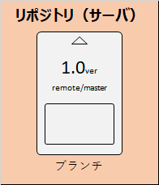

# Gitの用語イメージ

## ブランチ
ファイルの状態や編集履歴を保存するメモリーカード  

## リポジトリ
メモリーカード（ブランチ）を保存する場所  

### リモートリポジトリ	
サーバ上のリポジトリ  

### ローカルリポジトリ	
ローカル（PC）上のリポジトリ  

## コミット
ファイルの編集履歴のセーブ  

## ブランチを切る
メモリーカード（ブランチ）を複製すること  

## クローン
サーバからローカルにリポジトリをコピー  

## プル
サーバからローカルにブランチを上書きコピー  

## プッシュ	
ローカルからサーバにブランチを上書きコピー  

## マージ
複製したブランチを別のブランチと合体させること。変更内容の差分が反映される。  

## プルリクエスト
「ブランチを別のブランチにマージして大丈夫か」のレビュー依頼

## issue	
改善の提案、タスク、または質問のこと。細かく追加していく。
